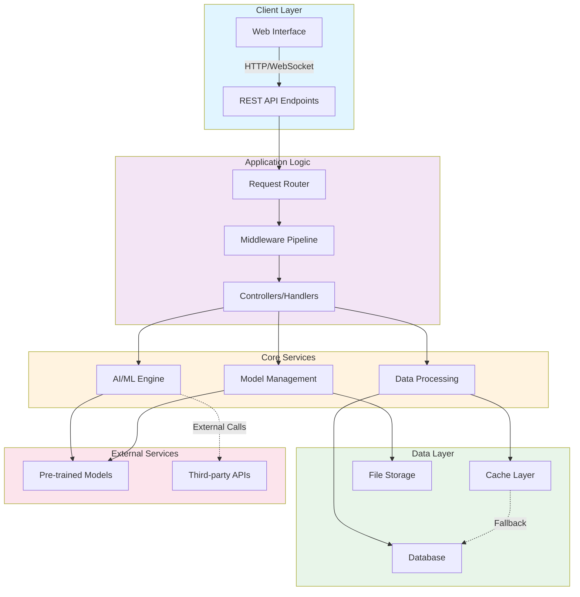

# AI Repository Architecture Overview

## System Architecture

This document outlines the high-level architecture of the Ai repository, showing how different components interact to deliver AI/ML capabilities.

### Architecture Diagram

## Component Descriptions

### Client Layer
- **Web Interface**: User-facing application for interacting with AI services
- **REST API Endpoints**: HTTP endpoints for programmatic access

### Application Logic
- **Request Router**: Directs incoming requests to appropriate handlers
- **Middleware Pipeline**: Handles cross-cutting concerns (logging, auth, validation)
- **Controllers/Handlers**: Business logic implementation

### Core Services
- **AI/ML Engine**: Core machine learning and inference capabilities
- **Data Processing**: Prepares and transforms data for model consumption
- **Model Management**: Handles model loading, versioning, and lifecycle

### Data Layer
- **Cache Layer**: Fast in-memory data storage for frequently accessed items
- **Database**: Persistent storage for application data
- **File Storage**: Stores models, datasets, and large artifacts

### External Services
- **Pre-trained Models**: Integration with external ML model repositories
- **Third-party APIs**: External service integrations

## Data Flow

1. **Request Ingestion**: Requests arrive via Web Interface or API endpoints
2. **Processing**: Router and Middleware process and validate requests
3. **AI Processing**: Controllers delegate to Core Services for AI operations
4. **Data Access**: Services query Cache/Database or retrieve Files as needed
5. **Response Generation**: Results are formatted and returned to client

## Key Features

- **Modular Design**: Clear separation of concerns across layers
- **Scalability**: Caching and async processing support
- **Extensibility**: Easy to add new models and services
- **Resilience**: Fallback mechanisms between cache and persistent storage
